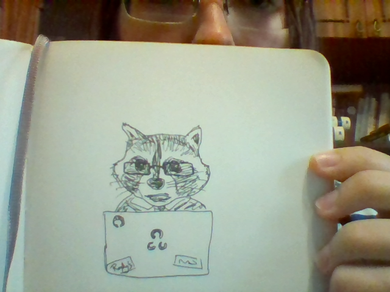
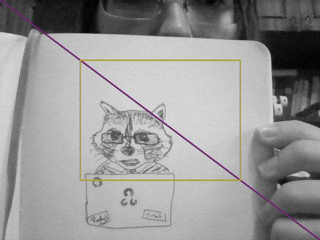

# Computer Vision Labs
Practice tasks for the Computer Vision course at Kyiv Polytechnic Institute

## Lab 0: A toe into madness

- Read an image from webcam
- Display the image
- Write the image to disk
- Load the image from disk
- Convert the image to grayscale
- Draw a line on the image
- Draw a rectangle on the image
- Display it again and write it to disk again (why not?)

### Example

