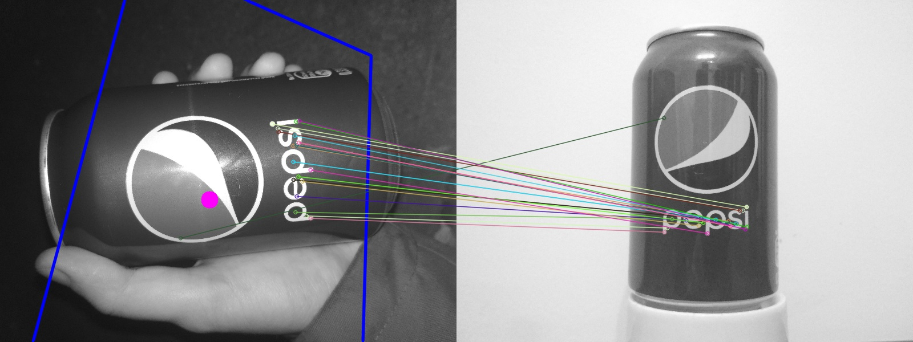

# Computer Vision Labs
Practice tasks for the Computer Vision course at Kyiv Polytechnic Institute

## Lab 1: Дві вежі
### Порівняння дескрипторів
(це замість гуглдоки)

#### Ключові точки
Ключових точок згенеровано:

|        | SIFT | BRISK |
|--------|------|-------|
|Пепсі   |  160 |  295  |
|Ведмедик|  113 |  179  |

Бачимо, що BRISK їх генерує приблизно в півтора рази більше, ніж SIFT.

Це BRISK:

Це SIFT:

Це BRISK:

Це SIFT:

Незважаючи на більшу кількість ключових точок, BRISK в цьому плані видається надійнішим: точки зосереджено по краях, майже немає зайвих точок. Чого не скажеш про SIFT.

Загалом для бляшанки Пепсі обидва алгоритми закономірно вважають ключовими лого та підпис (BRISK — ще й металічні краї), а для ведмедика — кінцівки, морду та талію.

#### Час роботи

Середній час роботи (мс):

|        | SIFT        | BRISK      |
|--------|-------------|------------|
|Пепсі   |  223.536178 |  37.968151 |
|Ведмедик|  159.495755 |  27.160081 |

Незважаючи на різний початковий розмір зображень, під час роботи програми вони обрізаються так, щоб ширина і довжина не перевищували 800 пікселів. Тому переважна більшість зображень 800х600. Відповідно, можемо зробити висновок, що Пепсі обробляється в півтора рази довше саме через те, що в неї в півтора рази більше ключових точок.

Ну, і видно, що BRISK **дуже** швидкий порівняно з SIFT — різниця майже в 6 разів на користь BRISK.

#### Якість розпізнання

Ну, тут все сумно у обох алгоритмів. Сумно в першу чергу через те, що обидва вони погано пристосовані для розпізнання:
  1) об'єктів, які легко змінюють форму (наприклад, ведмедиків),
  2) циліндрів, що обертаються у просторі (наприклад, бляшанки) — скоріш за все, тут кращим вийшов би ASIFT,
  3) об'єктів, схожих на задані (скоріше, вони для цього надто пристосовані), особливо якщо фотографії було зроблено задля того, щоб над цим алгоритмом познущатись.
  
Окрім власне цих алгоритмів, в усіх випадках на отриманих співпадіннях ми застосовували `findHomography()` для того, щоб (спробувати) знайти контур об'єкта. Показав він себе не дуже, але кілька разів щось знайти все-таки зміг, наприклад:

(Синім позначено контур, а рожева пляма позначає його геометричний центр.)

BRISK:

SIFT:

Кількість фото, на яких можна зробити вигляд, що контур розпізнаного об'єкта відповідає дійсності:

|        | SIFT | BRISK |
|--------|------|-------|
|Пепсі   |  24  |  16   |
|Ведмедик|  6   |  2    |

Бачимо, що SIFT з цим впорався набагато краще, ніж BRISK, хоча не те щоб вражаюче. Ще Пепсі простіше розпізнавати як об'єкт, ніж ведмедика.

Кількість фото, де ключові точки переважно суміщені вірно:

|        | SIFT | BRISK |
|--------|------|-------|
|Пепсі   |  52  |  28   |
|Ведмедик|  15  |  15   |

Ведмедик виявився надто важкою задачею для обох алгоритмів, але тут вони принаймні показали схожий результат. Тоді як у випадку з Пепсі результат SIFT набагато кращий.

Колір: колір алгоритми не хвилює. Навіть різного ступеня освітленості. Чорну бляшанку пепсі обидва пречудово розпізнають:

BRISK:

SIFT:

Освітлення: у BRISK з поганим освітленням сумніше, ніж у SIFT.

BRISK: не розпізнав нічого.

SIFT: ну хоч щось.

З Пепсі гірше: за відсутності освітлення розпізнають обидва, але якусь маячню.

BRISK:

SIFT:

Взагалі, навіть якщо на фото об'єкта нема, обидва алгоритми не здаються...

BRISK:

SIFT:

Подібні предмети (собаку) обидва алгоритми замість шуканих не розпізнали, але це, скоріш за все, просто тому що вони дуже погано розпізнавали ведмедика.

Коли у кадрі забагато всього, SIFT працює краще:

BRISK:

SIFT:

До речі, те, що повороти без усіляких афінних штук розпізнаються краще, демонструє це (але й тут SIFT кращий):

BRISK:

SIFT:

Головний недолік SIFT — він запатентований, а тому:
  - поки його налаштуєш в Python, можна з глузду з'їхати
  - для комерційних проектів його використовувати не можна

Порівняльна таблиця:

|        | SIFT | BRISK |
|--------|------|-------|
|ключові точки   |  гірше  |  краще   |
|час|  гірше  |  краще   |
|розпізнання об'єкту|  краще  |  гірше   |
|суміщення ключових точок|  краще  |  гірше   |
|колір|  погано  |  погано   |
|погане освітлення|  якось  |  ніяк   |
|відсутність об'єкта|  не проблема :/  | не проблема :/ |
|циліндричні об'єкти|  непогано  |  погано   |
|пласкі об'єкти|  добре  |  непогано   |
|ведмедики|  дуже погано  |  дуже погано   |

### Висновок

Хоч BRISK і набагато швидший, SIFT помітно якісніший, тому радимо використовувати його. Звісно, якщо це не суперечить патентові.

## Lab 0: A toe into madness

- Read an image from webcam
- Display the image
- Write the image to disk
- Load the image from disk
- Convert the image to grayscale
- Draw a line on the image
- Draw a rectangle on the image
- Display it again and write it to disk again (why not?)

### Example

